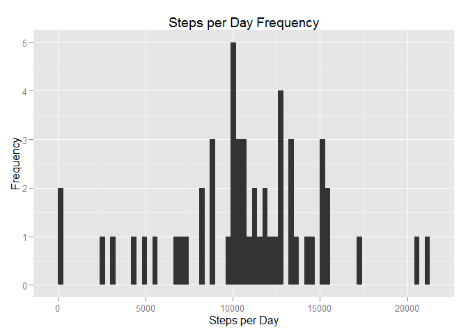
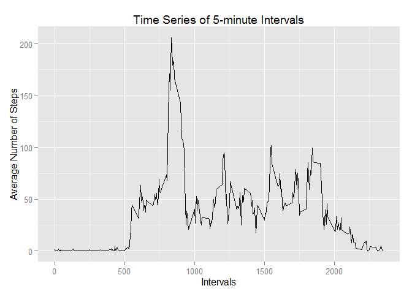
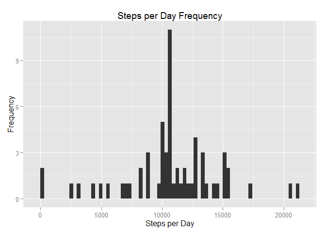
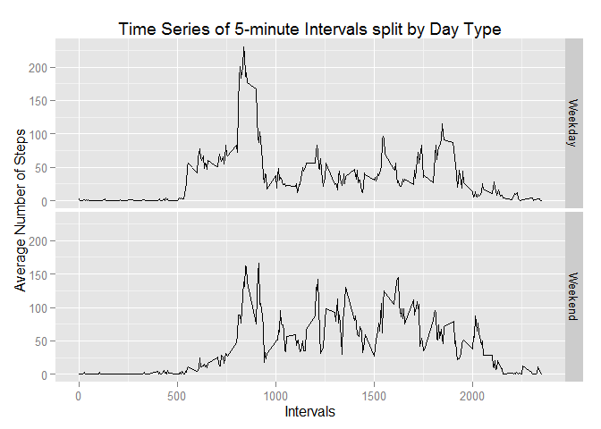

# Peer Assessment 1

Set up. Will be using the ggplot2 package for plotting. https://cran.r-project.org/web/packages/ggplot2/index.html

```r
library(ggplot2)
echo = TRUE
```

## Loading and preprocessing the data
### 1.Loading the data
Unzip the activity file, then read it


```r
unzip('repdata_data_activity.zip')
myRawData <- read.csv('activity.csv')
```

### 2.Process the data
Set myData to omit missing values


```r
myData <- na.omit(myRawData)
```


## What is the mean total number of steps taken per day?
For this part of the assignment, you can ignore the missing values in the dataset.

### 1. Calculate the total number of steps taken per day

```r
NumberOfSteps <- aggregate(myData$steps, list(myData$date), FUN=sum, na.rm=TRUE)$x
```

### 2. If you do not understand the difference between a histogram and a barplot, research the difference between them. Make a histogram of the total number of steps taken each day

```r
qplot(NumberOfSteps, main="Steps per Day Frequency", xlab="Steps per Day", ylab="Frequency", binwidth=300)
```

 

### 3. Calculate and report the mean and median of the total number of steps taken per day

```r
#mean number of steps per day
mean(NumberOfSteps)
```

```
## [1] 10766.19
```

```r
#median number of steps per day
median(NumberOfSteps)
```

```
## [1] 10765
```

## What is the average daily activity pattern?
### 1. Make a time series plot (i.e. type = "l") of the 5-minute interval (x-axis) and the average number of steps taken, averaged across all days (y-axis)

```r
myAverageSteps <- aggregate(myData$steps, list(interval = myData$interval), FUN=mean, nr.rm=TRUE)
```


```r
ggplot(myAverageSteps, aes(myAverageSteps$interval, myAverageSteps$x)) + geom_line() + labs(title="Time Series of 5-minute Intervals", x="Intervals", y="Average Number of Steps")
```

 

### 2. Which 5-minute interval, on average across all the days in the dataset, contains the maximum number of steps?

```r
myAverageSteps[myAverageSteps$x == max(myAverageSteps$x),]
```

```
##     interval        x
## 104      835 206.1698
```

## Imputing missing values
Note that there are a number of days/intervals where there are missing values (coded as NA). The presence of missing days may introduce bias into some calculations or summaries of the data.

### 1. Calculate and report the total number of missing values in the dataset (i.e. the total number of rows with NAs)

```r
sum(is.na(myRawData))
```

```
## [1] 2304
```
The total number of rows with NAs is: 2304

### 2. Devise a strategy for filling in all of the missing values in the dataset. The strategy does not need to be sophisticated. For example, you could use the mean/median for that day, or the mean for that 5-minute interval, etc.
Leveradge the previous section's question 1 result of average number of steps per interval. Will replace all NA values with their respective interval averages.


### 3. Create a new dataset that is equal to the original dataset but with the missing data filled in.

```r
myFullData <- myRawData 
for(i in 1:nrow(myFullData))
  {
    if(is.na(myFullData$steps[i]))
      {
        myFullData$steps[i] <- myAverageSteps[myAverageSteps$interval == myFullData$interval[i],]$x
      }
  }

#quick check to ensure above loop worked as expected (ie. 0 NAs appear in myFullData)
sum(is.na(myFullData))
```

```
## [1] 0
```

### 4. Make a histogram of the total number of steps taken each day and Calculate and report the mean and median total number of steps taken per day. Do these values differ from the estimates from the first part of the assignment? What is the impact of imputing missing data on the estimates of the total daily number of steps?

```r
myStepsTaken <- aggregate(myFullData$steps, list(myFullData$date), FUN=sum, na.rm=TRUE)$x
```


```r
qplot(myStepsTaken, main="Steps per Day Frequency", xlab="Steps per Day", ylab="Frequency", binwidth=300)
```

 


```r
#mean number of steps per day
mean(myStepsTaken)
```

```
## [1] 10766.19
```

```r
#median number of steps per day
median(myStepsTaken)
```

```
## [1] 10766.19
```
The mean of total number of steps taken per day: 1.0766189\times 10^{4}
The median of total number of steps taken per day: 1.0766189\times 10^{4}

There is virtually no difference between these values and the estimates from the first part. This is due the strategy picked in question 2 as the value that were added happened to be the average and the median value thus it doesn't differ the aggregated results. However, we can clearly see that the values have changed by looking at the plots.  


## Are there differences in activity patterns between weekdays and weekends?
For this part the weekdays() function may be of some help here. Use the dataset with the filled-in missing values for this part.

### 1. Create a new factor variable in the dataset with two levels - "weekday" and "weekend" indicating whether a given date is a weekday or weekend day.

```r
myWeekData <- myFullData
myWeekData["DayType"] <- NA
myWeekData$date <- as.Date(myWeekData$date)

for(i in 1:nrow(myWeekData))
  { 
    if(weekdays(myWeekData$date[i]) %in% c("Monday", "Tuesday", "Wednesday", "Thursday", "Friday"))
      {
        myWeekData$DayType[i] <- "Weekday"
      }
    else
      {
        myWeekData$DayType[i] <- "Weekend"
      }
  }
```

### 2. Make a panel plot containing a time series plot (i.e. type = "l") of the 5-minute interval (x-axis) and the average number of steps taken, averaged across all weekday days or weekend days (y-axis). See the README file in the GitHub repository to see an example of what this plot should look like using simulated data.

```r
myAverageDateType <- aggregate(steps ~ interval + DayType, myWeekData, FUN=mean, na.rm=TRUE)
```


```r
ggplot(myAverageDateType, aes(interval, steps)) + geom_line() + facet_grid(DayType ~.) + labs(title="Time Series of 5-minute Intervals split by Day Type", x="Intervals", y="Average Number of Steps")
```

 


